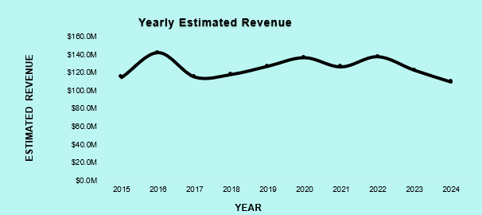
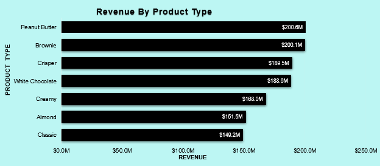
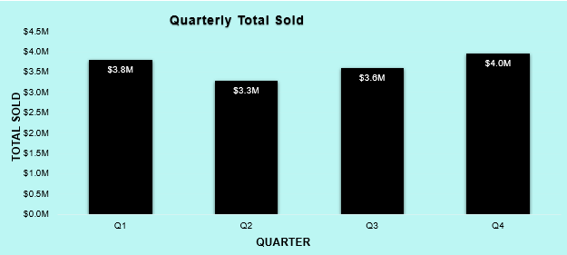
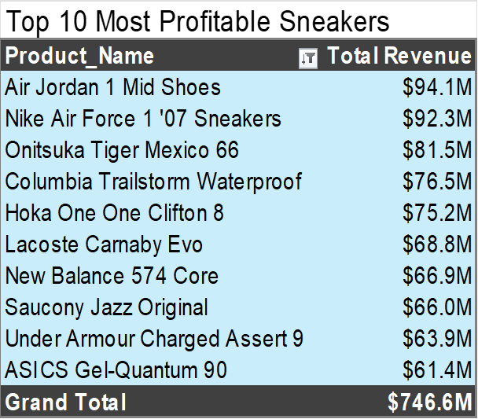
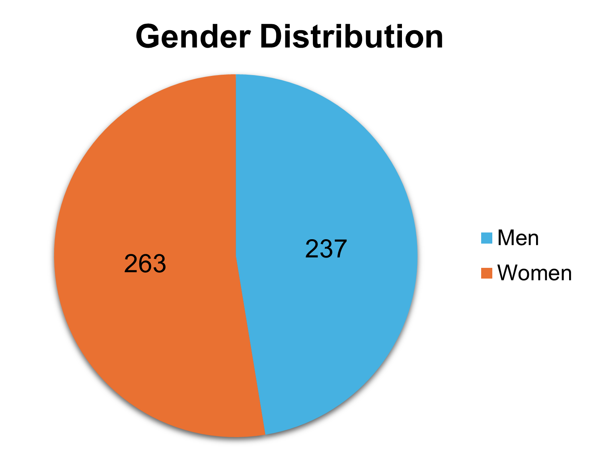

# 👟 Sneakers Dashboard (Excel Project)

This Excel-based dashboard analyzes sales and performance data of 500+ sneaker products using power query, pivot tables, sales KPI cards, and dynamic slicers.

---

## 📊 Features

- Interactive KPI cards:
  - Total Revenue
  - Average Unit Price
  - Most Sold Product
  - Highest-Selling Edition
- Slicers to filter by Year, Editionn and target gender
- Top 10 most profitable sneakers
- Trend charts (Area, Column)
- Clean layout

---

## 📁 Dataset

Source: [Kaggle - 500 Sneakers Dataset](https://www.kaggle.com/datasets/comhek/500-snickers-dataset/data)  
Contains details like product name, brand, category, edition, release date, and sales units.

---

## 🛠 Tools Used

- Microsoft Excel (Pivot Table, Slicers, Charts)
- Power Query

---

## 🧠 What I Learned

- Creating interactive dashboards in Excel
- Working with slicers and linked charts
- Using `GETPIVOTDATA` for dynamic metrics
- Cleaning, sorting, adding column and calculating data using power query
- Using pivot tables for filtering data
- Using pivot charts from pivot table data

---

## 📸 Preview

---

## 📌 Status

✅ Version 1.0 complete  
🔄 Future updates planned (storytelling with data, color themes, forecast analysis, UX improvements)

